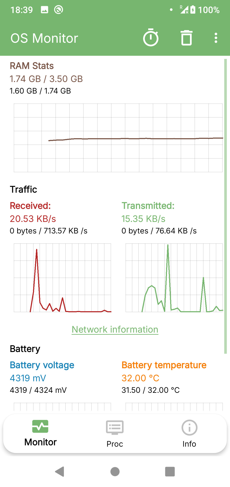
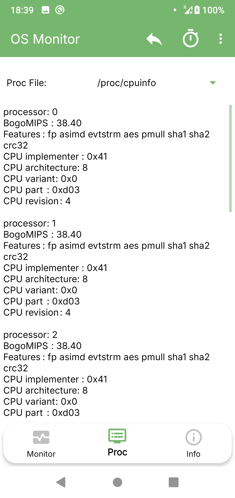
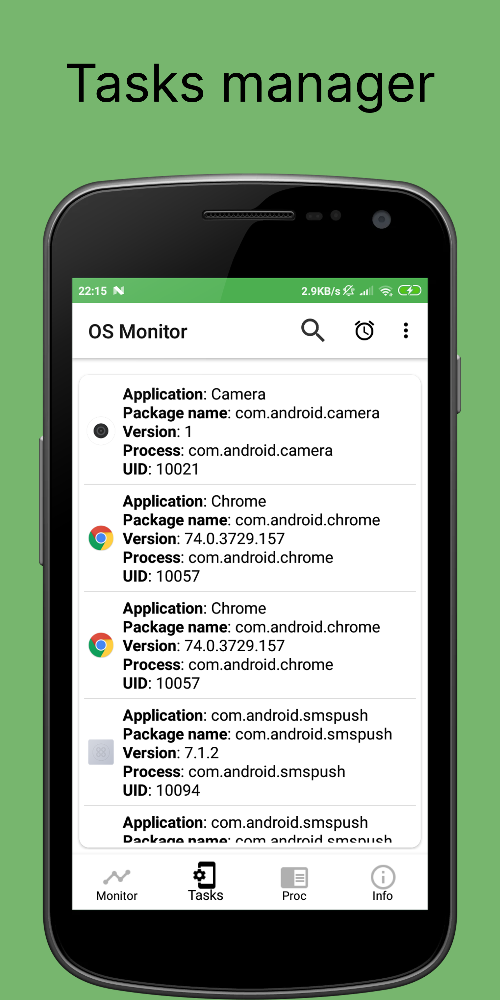

# OS Monitor
 

Powerful and simple monitoring for your Android device. The app displays various system components and resources, such as battery, CPU information, RAM usage, network manager. OS Monitor displays the processes of applications running on your Android device, as well as incoming and outgoing network traffic, so you can check the status of system components and see how installed applications affect your device's efficiency and performance.

Download os monitor apk

## Features
* Tasks manager
* Battery status and usage app
* RAM, disk usage
* CPU detector
* Monitor mobile and wi-fi data
* Proc Files Reader
* And more ...

## Screenshots
<table>
  <tr>
    <td></td>
    <td></td>
    <td></td>
	</tr>
</table>

## Compatibility
Latest version supports Android 8.0+ (Android APi 26+) and [legacy](https://github.com/IP-Tools-App/os-monitor-apk/releases/tag/1.40) version for Android 5.0+ (Android API 21+). All architectures.

## EULA & Privacy Policy
By downloading or opening the application, you accept the [user agreement and privacy policy](https://ip-tools.app/eula). 
You may not: copy, modify, translate or create derivative works based on the  IP Tools ("Software"); distribute, transfer, publish, disclose, sublicense, lease, lend, sell or rent the Software to any third party; reverse engineer, decompile, reverse decompile or disassemble the Software, or otherwise attempt to derive the source code; make the functionality of the Software available to third parties or multiple users through any means, or benchmark or conduct any performance or comparison tests on the Software. IP Tools Network Utilities reserves all rights in and to the Software not expressly granted to you under EULA.
